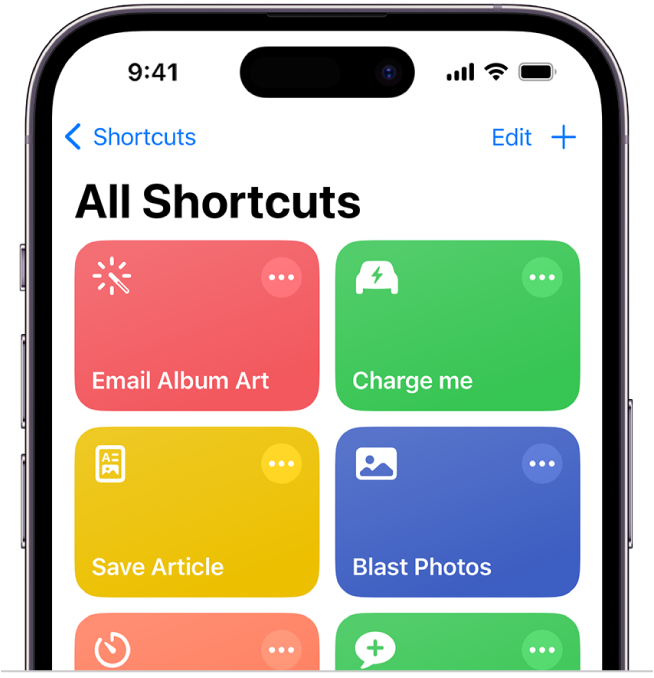
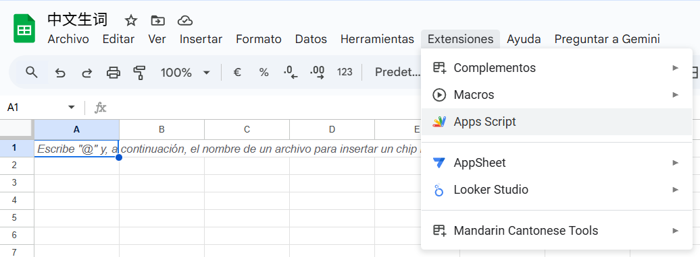
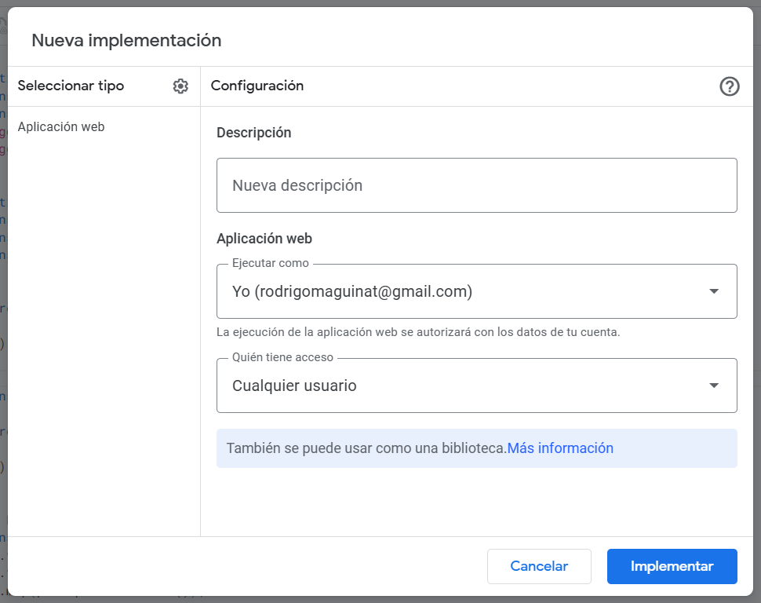
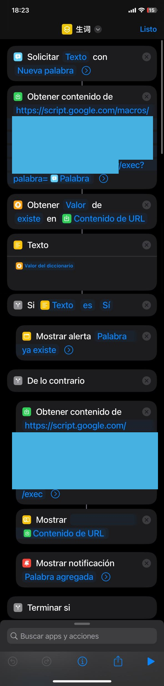

# Chinese-Words
To can add new Chinese words from iphone shortcuts to Google Sheets with Apps Scripts

  

## Steps

### 1. Open Google Sheets
Create a Google Sheets and then select the extension Apps Script

  

### 2. On Apps Script
Copy code.gs, then click on "Implementar"

  

Select "Nueva Implementacion"

  

Finally will appear a window with an URL, we should copy it

### 3. On Shortcuts
Follow this actions and use the URL that we copied 

  

🍟The first URL 
* The end of the link should be : ?palabra=<Palabra> ("Palabra" it's a variable on the first action)
* Método → GET

🍟The second URL
* Método → POST.
* “Cuerpo de la solicitud” → Formulario.  
* “Agregar nuevo campo”:  
  * "Clave" → palabra  
  * "Valor" → select your variable "Palabra" 
